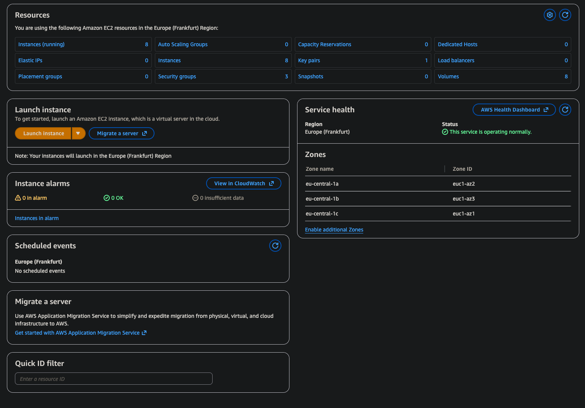
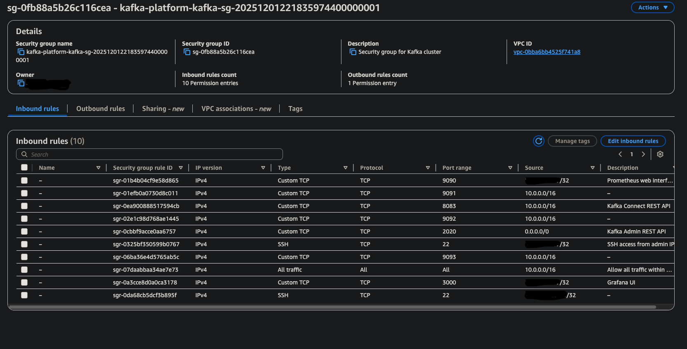
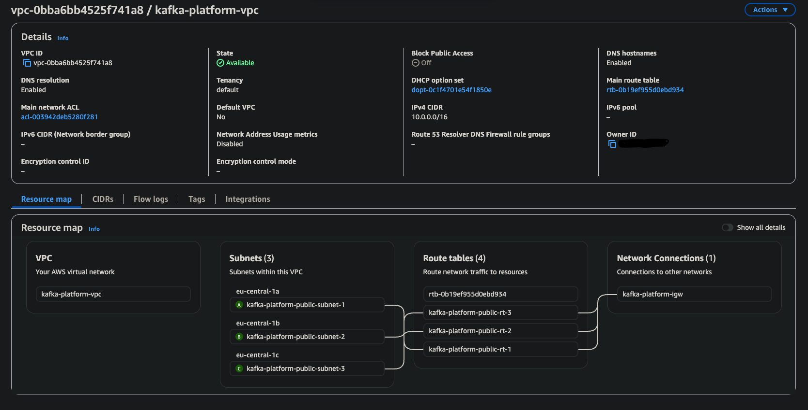

# Section 1: Infrastructure

> Terraform - AWS

## About

All infrastructure is provisioned on AWS using Terraform. The setup includes a VPC with 3 subnets across different availability zones for high availability. Each Kafka component (controllers, brokers, connect, platform) runs on dedicated EC2 instances.

Everything is modular - network and compute are separate Terraform modules. This makes it easy to modify or extend.

## Overview

- VPC with 3 subnets (1 per AZ)
- 8 EC2 instances
- Security groups
- Modular structure

## Nodes

| Node | Private IP   | AZ |
|------|--------------|-----|
| controller-1 | 10.0.101.10  | eu-central-1a |
| controller-2 | 10.0.102.10  | eu-central-1b |
| controller-3 | 10.0.103.10  | eu-central-1c |
| broker-1 | 10.0.101.166 | eu-central-1a |
| broker-2 | 10.0.102.239 | eu-central-1b |
| broker-3 | 10.0.103.53  | eu-central-1c |
| kafka-connect | 10.0.101.80  | eu-central-1a |
| platform | 10.0.101.207 | eu-central-1a |

## Network

```
VPC: 10.0.0.0/16
├── 10.0.101.0/24 (eu-central-1a)
├── 10.0.102.0/24 (eu-central-1b)
└── 10.0.103.0/24 (eu-central-1c)
```

## Security Group

| Port | Source | Description |
|------|--------|-------------|
| 22 | Admin IP | SSH |
| 9091-9093 | VPC | Kafka |
| 8083 | VPC | Connect REST |
| 9090 | Admin IP | Prometheus |
| 3000 | Admin IP | Grafana |
| 2020 | 0.0.0.0/0 | REST API |

## Usage

```bash
cd 1-infrastructure/envs/dev
terraform init
terraform plan -out=tfplan
terraform apply tfplan
```

## Outputs

```bash
terraform output
```

```
infrastructure_summary = {
  "brokers" = {
    "count" = 3
    "private_ips" = ["10.0.101.166", "10.0.102.239", "10.0.103.53"]
  }
  "controllers" = {
    "count" = 3
    "private_ips" = ["10.0.101.10", "10.0.102.10", "10.0.103.10"]
  }
  "kafka_connect" = {
    "private_ip" = "10.0.101.80"
  }
  "platform" = {
    "private_ip" = "10.0.101.207"
  }
  "subnets" = {
    "azs" = ["eu-central-1a", "eu-central-1b", "eu-central-1c"]
    "cidrs" = ["10.0.101.0/24", "10.0.102.0/24", "10.0.103.0/24"]
  }
  "vpc" = {
    "cidr" = "10.0.0.0/16"
  }
}
monthly_cost_estimate = {
  "total" = "$45.18"
}
```

SSH commands are also generated:
```bash
terraform output -json | jq '.ssh_commands.value'
```

## Screenshots







---

**Next:** [Kafka Cluster](./02-kafka-cluster.md)