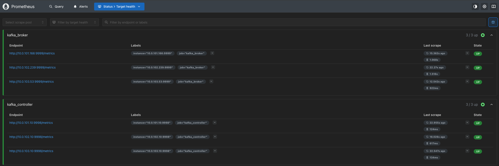
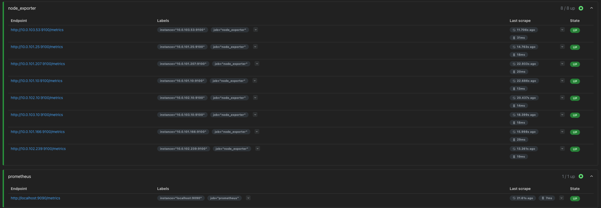
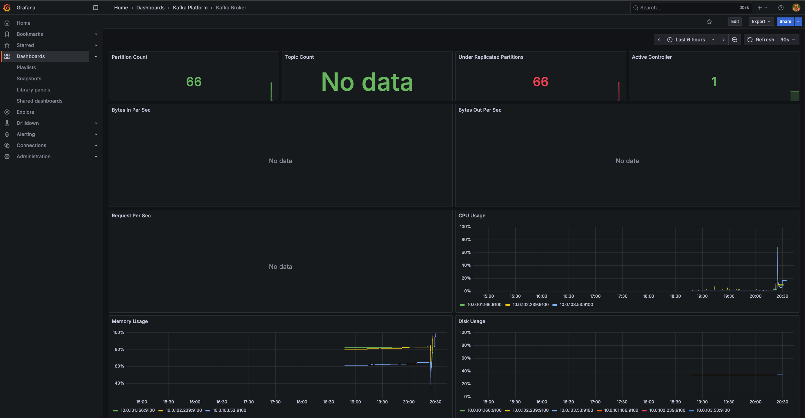
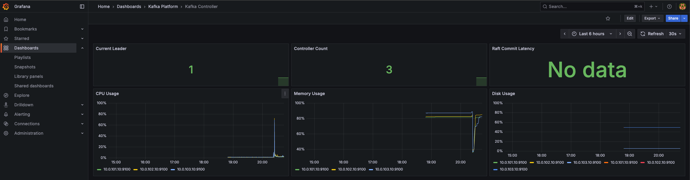

# Section 3: Observability

> Prometheus + Grafana + Alertmanager

## About

Monitoring stack deployed on platform node using Docker Compose. All Kafka nodes have node_exporter for system metrics. JMX Exporter configured for Kafka JMX metrics.

## Components

| Component | Port | Description |
|-----------|------|-------------|
| Prometheus | 9090 | Metrics collection |
| Grafana | 3000 | Dashboards |
| Alertmanager | 9093 | Alert routing |
| node_exporter | 9100 | System metrics (all nodes) |
| JMX Exporter | 9999/9998 | Kafka metrics |

## Deployment

### 1. node_exporter (all nodes)

```bash
cd 2-configuration
ansible-playbook -i inventory/hosts.yml playbooks/node-exporter.yml
```

Output:
```
PLAY RECAP
broker-1       : ok=8    changed=6    failed=0
broker-2       : ok=8    changed=6    failed=0
broker-3       : ok=8    changed=6    failed=0
controller-1   : ok=8    changed=6    failed=0
controller-2   : ok=8    changed=6    failed=0
controller-3   : ok=8    changed=6    failed=0
kafka-connect-1: ok=8    changed=5    failed=0
platform       : ok=8    changed=6    failed=0
```

### 2. JMX Exporter (broker + controller)

```bash
ansible-playbook -i inventory/hosts.yml playbooks/jmx-exporter.yml
```

> This adds JMX Exporter agent to Kafka services and restarts them.

### 3. Monitoring stack (platform node)

```bash
ansible-playbook -i inventory/hosts.yml playbooks/monitoring-stack.yml
```

## Verification

Prometheus targets: `http://<PLATFORM_IP>:9090/targets`




## Dashboards

Grafana: `http://<PLATFORM_IP>:3000`

Login: admin / admin123

### Kafka Broker



Metrics:
- Partition Count
- Topic Count
- Under Replicated Partitions
- Active Controller
- Bytes In/Out Per Sec
- Request Per Sec
- CPU, Memory, Disk Usage

### Kafka Controller



Metrics:
- Current Leader
- Controller Count
- Raft Commit Latency
- CPU, Memory, Disk Usage

### Kafka Connect

> Dashboard ready, metrics will show after Section 5.

Metrics:
- Worker Count
- Connector Count (Total, Running, Failed)
- Task Count (Total, Running, Failed)
- CPU, Memory Usage

## Alert Rules

Configured in `prometheus/alerts.yml`:

**Infrastructure:**
- Instance down (1m)
- Memory > 85% (5m)
- Disk < 20% (5m)
- CPU > 80% (5m)

**Kafka:**
- Under-replicated partitions (1m)
- High request latency p95 > 100ms (5m)

**Kafka Connect (after Section 5):**
- Failed connector
- Failed task
- High producer incoming byte rate

## File Structure

```
4-platform/monitoring-stack/
├── docker-compose.yml
├── prometheus/
│   ├── prometheus.yml
│   └── alerts.yml
├── alertmanager/
│   └── alertmanager.yml
└── grafana/
    └── provisioning/
        ├── datasources/
        │   └── datasource.yml
        └── dashboards/
            ├── dashboards.yml
            ├── kafka-broker.json
            ├── kafka-controller.json
            └── kafka-connect.json
```

---

**Next:** [REST API](./04-rest-api.md)